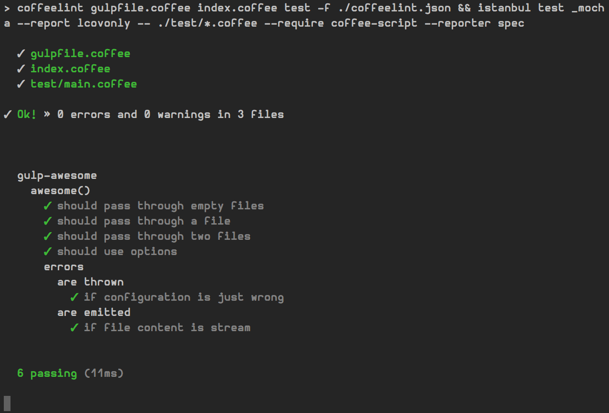

# generator-gulpplugin-coffee [![NPM version][npm-image]][npm-url]
[![Build Status][travis-image]][travis-url] [![Coverage Status][coveralls-image]][coveralls-url] [![Dependency Status][depstat-image]][depstat-url] [![devDependency Status][devdepstat-image]][devdepstat-url]

> A [Yeoman](http://yeoman.io) generator for CoffeeScript [gulp][gulp] plugins.

## Getting started
* Install yeoman `npm install -g yo`.
* Install generator `npm install -g generator-plugin-coffee`.
* Scaffold out the plugin `yo gulpplugin-coffee`.

## What do you get?
A working gulp plugin following the guidelines and best practices described in the [gulp documentation][gulp-documentation], complete with a working workflow and test environment including [Travis CI](https://travis-ci.org) and [Coveralls](https://coveralls.io) integration.

## Contributing
In lieu of a formal styleguide, take care to maintain the existing coding style. Add unit tests for any new or changed functionality. Lint and test your code using [gulp][gulp] and [npm-test](https://npmjs.org/doc/test.html).

## Credits
* [Generator for CoffeeScript Yeoman generators](https://npmjs.org/package/generator-generator_grunt_coffee)
* [Generator for JavaScript gulp plugins](https://npmjs.org/package/generator-gulp-plugin)

## License
[MIT License](http://en.wikipedia.org/wiki/MIT_License) © [Jan Raasch](http://janraasch.com)

[gulp]: http://gulpjs.com/
[gulp-documentation]: https://github.com/gulpjs/gulp/blob/master/docs/README.md

[npm-url]: https://npmjs.org/package/generator-gulpplugin-coffee
[npm-image]: https://badge.fury.io/js/generator-gulpplugin-coffee.png

[travis-url]: http://travis-ci.org/janraasch/generator-gulpplugin-coffee
[travis-image]: https://secure.travis-ci.org/janraasch/generator-gulpplugin-coffee.png?branch=master

[coveralls-url]: https://coveralls.io/r/janraasch/generator-gulpplugin-coffee
[coveralls-image]: https://coveralls.io/repos/janraasch/generator-gulpplugin-coffee/badge.png

[depstat-url]: https://david-dm.org/janraasch/generator-gulpplugin-coffee
[depstat-image]: https://david-dm.org/janraasch/generator-gulpplugin-coffee.png

[devdepstat-url]: https://david-dm.org/janraasch/generator-gulpplugin-coffee#info=devDependencies
[devdepstat-image]: https://david-dm.org/janraasch/generator-gulpplugin-coffee/dev-status.png
